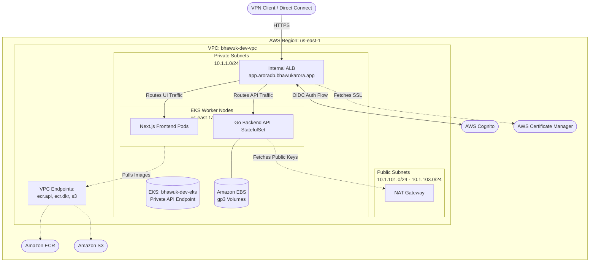

# Infrastructure Setup

Bhawuk-AroraDB uses an Infrastructure-as-Code (IaC) approach driven by Terraform to manage the AWS cloud environment.

## Fully Private Architecture Design

The infrastructure is designed with a **Zero-Trust, Fully Private Architecture** to comply with strict enterprise security requirements.

### Architecture Diagram



### Key Architectural Decisions

#### 1. Private EKS Control Plane
The EKS Kubernetes API endpoint has been completely removed from the public internet. 
- `cluster_endpoint_public_access = false`
- `cluster_endpoint_private_access = true`

**Impact**: Developers and CI/CD pipelines cannot run `kubectl` commands against the cluster unless they are connected to the internal AWS VPC network (via AWS Client VPN, Direct Connect, or a Bastion Host).

#### 2. Internal Load Balancer
The Application Load Balancer (ALB) provisioned by the AWS Load Balancer Controller uses an `internal` scheme.
- It does not receive a public Elastic IP.
- It only routes traffic originating from within the VPC.

**Impact**: The application (`app.aroradb.bhawukarora.app`) is inaccessible from the public internet, satisfying intranet-only deployment requirements.

#### 3. Outbound NAT Gateway (Crucial Trade-off)
While the entire inbound architecture is completely private (no public IPs on nodes, internal ALB, private EKS control plane), **we intentionally retained the NAT Gateway for outbound internet traffic.**

**Why?**
The Go backend API utilizes stateless OIDC authentication via the ALB. To securely verify the JWT signatures injected by the ALB, the Go backend must dynamically download the ALB's public signing keys from AWS. AWS hosts these keys on a public internet endpoint (`https://public-keys.auth.elb.us-east-1.amazonaws.com`). 

Because AWS does not provide a VPC Endpoint (PrivateLink) for this specific public key bucket, disabling the NAT Gateway would completely air-gap the pods, preventing the backend from verifying JWTs and breaking all authentication. The NAT Gateway provides this necessary outbound-only route while keeping inbound access strictly sealed.

#### 4. ECR PrivateLink (Cost Optimization)
Even though the NAT Gateway is present, we provisioned **VPC Endpoints (PrivateLink)** for Amazon ECR (`ecr.api`, `ecr.dkr`) and Amazon S3 (Gateway).

**Why?**
When the Kubernetes worker nodes pull heavy database container images, routing that massive data transfer through the NAT Gateway would incur standard NAT data processing fees (`~$0.045 per GB`). By adding VPC Endpoints for ECR and S3, the image pull traffic stays completely on the internal AWS network backbone, saving significant costs during scaling events while maintaining strict privacy.

#### 5. Deployment Access via Bastion Host
Because the EKS Control Plane is fully private, you cannot run `kubectl` or `helm` commands from your local laptop over the public internet. 
To deploy applications or manage the cluster, we use a **Bastion Host** (Jump Box):
- A small EC2 instance (e.g., `t3.micro`) is deployed in the Public Subnet.
- Engineers connect to it via **AWS EC2 Instance Connect** (no open SSH ports required).
- From inside the Bastion Host terminal, engineers can securely communicate with the private EKS API endpoint.

---

## The Core Environment (`dev`)

The core infrastructure is located in `terraform/environments/dev` and provisions:
- **AWS VPC**: The virtual network where the database runs (containing the NAT Gateway and Subnets).
- **Amazon EKS**: The managed private Kubernetes cluster running the stateless Go backend pods and Next.js frontend.
- **EBS CSI Driver**: Used for provisioning fast gp3 NVMe persistent volumes for the database shards.

## The Ingress Environment (`dev/ingress`)

To manage the routing and edge security separately from the core cluster, we have a standalone Terraform workspace located in `terraform/environments/dev/ingress`.

This isolated environment provisions:
1. **AWS Load Balancer Controller**: A Helm deployment that allows Kubernetes to spin up physical internal ALBs in AWS.
2. **IAM Roles for Service Accounts (IRSA)**: Grants the ALB Controller the exact AWS permissions it needs to manage load balancers.
3. **ACM Certificates**: Automatically requests an SSL certificate so the internal ALB can handle secure HTTPS traffic.

### How to Deploy Ingress
Because the ingress infrastructure is isolated, you can deploy or update it without risking changes to your core database nodes:
```bash
cd terraform/environments/dev/ingress
terraform init
terraform apply
```
